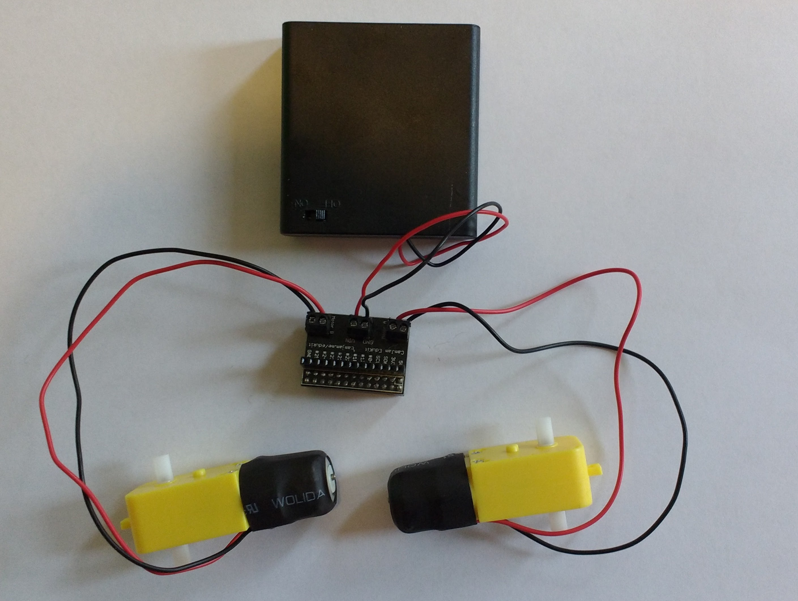
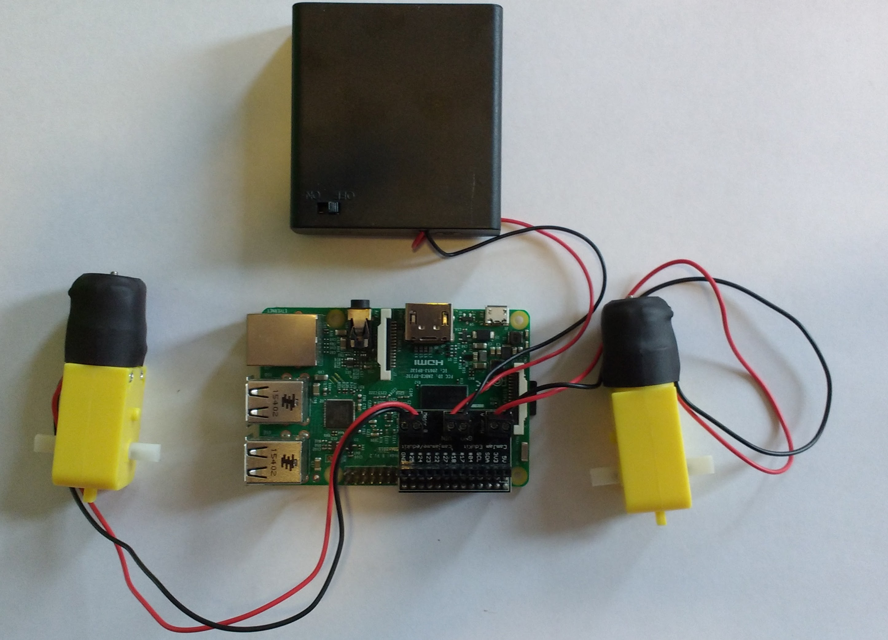

- Take your motor controller board, and using a small screwdriver, loosen the screws in each of the three terminal blocks.

- The motors can be connected into their terminal blocks anyway around, and the screws then tightened so that they are held securely in place.

- The battery pack *must* be connected so that the red wire goes into port labelled UTN. The black wire goes into the port labelled GND. Make sure the battery pack is turned off as you do this.

	

- The style of motor controller board used in this project can sit directly onto the Raspberry Pi GPIO header pins, and uses pins 7, 8, 9 and 10. With motors and power connected, and your Raspberry Pi switched off, you can place the board over the pins of your Raspberry Pi as shown below.

	

- You can now power your Raspberry Pi up.
